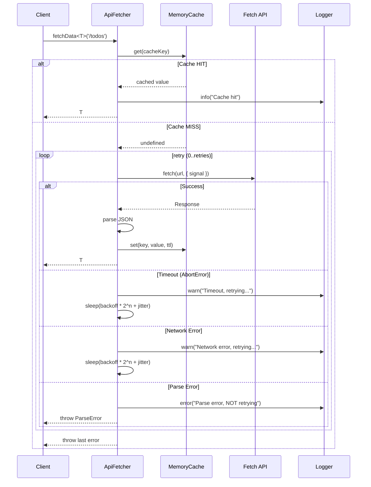

# NEETCODE — ts105: API Fetcher & Cache

## N — Nature / Overview

A typed async data-fetching library with caching, retry logic, exponential backoff + jitter, and structured error handling. Teaches: Promises, async/await, error hierarchies, caching strategies.

**Role**: First async-heavy project. Introduces AbortController, retry loops, and pluggable strategies.

---

## E — Execution Flow (Sequence Diagram)



---

## E — Edge Cases

| Scenario | Handling |
|----------|----------|
| Network failure (fetch throws) | Caught, retried up to `retries` count |
| Timeout (AbortController) | `AbortError` → `TimeoutError`, retried |
| Non-JSON response | `ParseError` — NOT retried (non-recoverable) |
| Cache entry expired | `get()` checks `expiresAt`, returns `undefined` on expiry |
| Thundering herd on retry | Jitter (+/-50%) spreads retry timing |
| All retries exhausted | Throws last error (preserves original cause) |

---

## T — Type System & Complexity

**Type constructs**: Generic `<T>`, `Awaitable<T>` (union of `Promise<T> | T`), error class hierarchy, interface strategies

**Time complexity**:
- Cache hit: O(1)
- Cache miss with no retry: O(N) network latency
- With retries: O(R) where R = retry count × backoff

**Space complexity**: O(C) for C cached entries

---

## C — Core Patterns (Design Patterns)

| Pattern | Usage |
|---------|-------|
| **Strategy Pattern** | `CacheStrategy<T>` interface — pluggable cache backends |
| **Template Method** | `fetchData()` fixed flow with customizable parts |
| **Error Hierarchy** | `ApiError` → `NetworkError`, `TimeoutError`, `ParseError` |
| **Exponential Backoff** | `sleep(backoff * 2^attempt + jitter)` |
| **AbortController** | Per-request timeout via AbortSignal |

---

## O — Optimization Notes

- Default MemoryCache is single-process — wrap with Redis for distributed caching
- Consider circuit breaker pattern for repeated failures
- Add `stale-while-revalidate` for better UX
- Exponential backoff can grow large — capped at `maxBackoffMs`

---

## D — Dependencies & Config

| Dependency | Version | Purpose |
|------------|---------|---------|
| cross-fetch | ^4.0.5 | Isomorphic fetch |
| TypeScript | ^5.2.2 | Compiler |
| Jest + ts-jest | 30.x/29.x | Testing |
| jest-fetch-mock | ^3.0.3 | Mock fetch in tests |
| ESLint | ^8.45 | Linting |
| Prettier | ^3.3.3 | Formatting |

---

## E — Evaluation / Testing

```
npm test       → 4 tests (fetch+cache, parse error, retry, timeout)
npm run build  → tsc --noEmit passes
npm run lint   → ESLint passes
```

**CI**: GitHub Actions (lint → build → test → coverage deploy to Pages)
