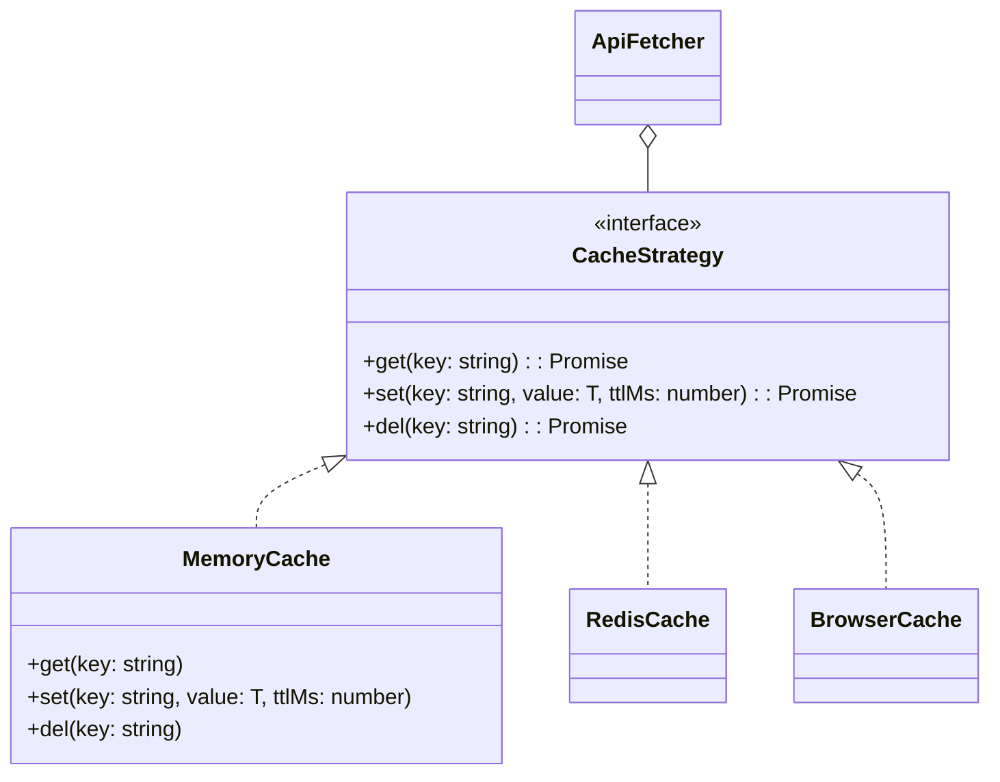
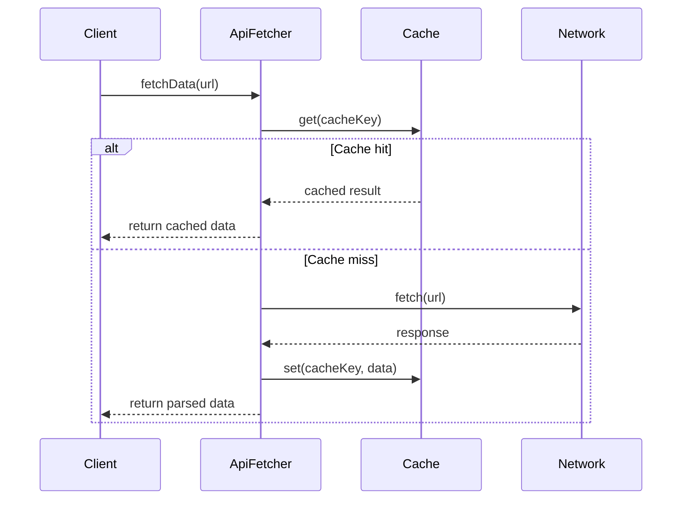
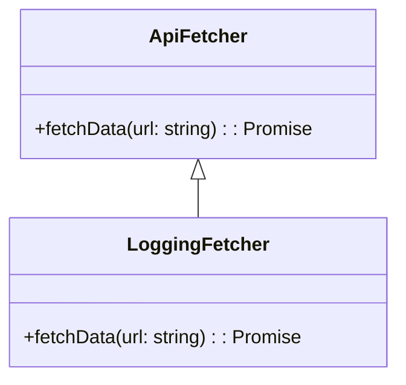
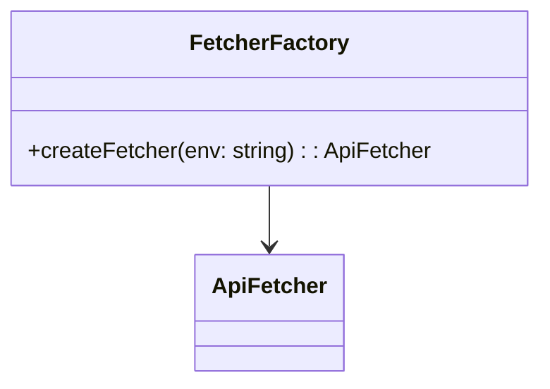
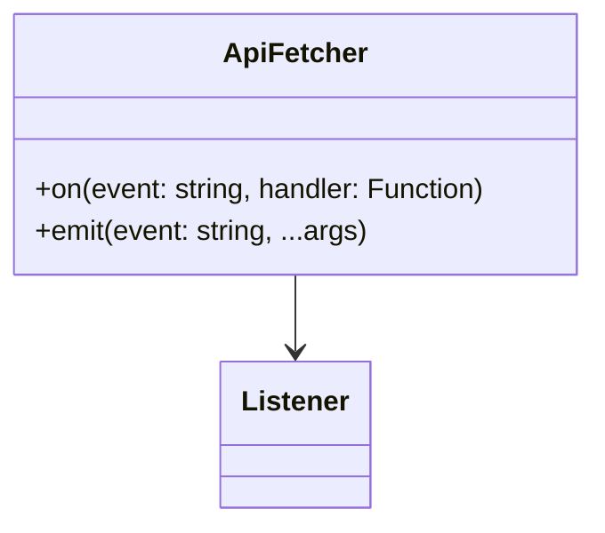
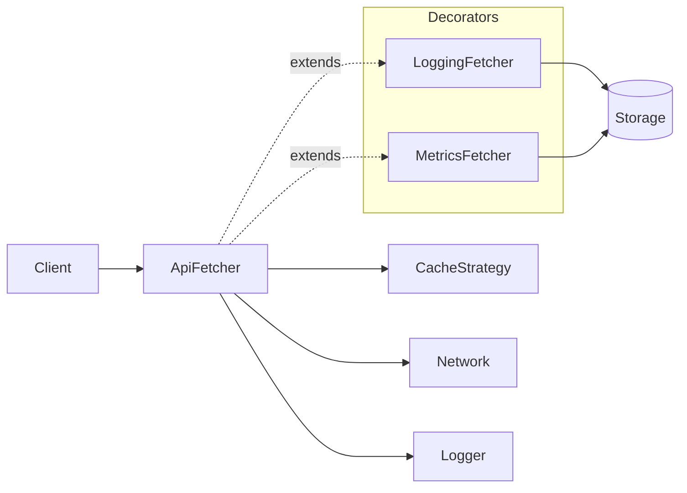

# Design Patterns in API Fetcher & Cache

This guide connects the architecture of the **API Fetcher & Cache** project to classic *Gang of Four (GoF)* design patterns. Understanding these patterns gives you vocabulary to describe and justify architectural choices in interviews.

---

## 1. Strategy Pattern — Pluggable Caching

**Intent:** Define a family of algorithms, encapsulate each one, and make them interchangeable.

### How it applies here

The caching system is built around a `CacheStrategy` interface:

```ts
export interface CacheStrategy<T> {
get(key: string): Promise<T | undefined> | T | undefined;
set(key: string, value: T, ttlMs: number): Promise<void> | void;
del?(key: string): Promise<void> | void;
}
```

This allows multiple caching mechanisms to be used interchangeably:

- MemoryCache (default in-memory Map)
- RedisCache (for distributed caching)
- BrowserCache (for localStorage/sessionStorage)

### Mermaid Class Diagram



### Benefits

- Open/Closed Principle: Extend without modifying ApiFetcher.

- Easy testability: Inject mock caches in unit tests.

### Interview takeaway

Interview takeaway

“I used the Strategy pattern to decouple the caching logic, enabling users to swap caching backends without changing core logic.”
---

## 2. Template Method Pattern — Fetch Flow Control

**Intent***: Define the skeleton of an algorithm in a method, deferring some steps to subclasses or collaborators.

### How it applies here

The ApiFetcher.fetchData() method defines a fixed high-level flow:

- Try reading from cache.
- Perform fetch with retry and timeout.
- Parse and store response.
- Return typed result.

Each step can have customizable parts:

- Logging can be swapped (different Logger implementations).
- Caching can be replaced (different CacheStrategy)

### Mermeid Sequence Diagram



### Benefits

- Consistent fetch behavior across APIs.
- Easier debugging and extension.

### Interview takeaway

“The Template Method pattern structures the async flow of fetching and caching, while still allowing customization of logging and cache behavior.”

## 3. Decorator Pattern — Adding Behavior Dynamically

**Intent:** Attach additional responsibilities to an object dynamically.

### How it applies here

Decorators can wrap the ApiFetcher to add logging, metrics, or analytics:

```ts
class LoggingFetcher<T> extends ApiFetcher {
async fetchData<U>(path: string, options?: FetchOptions): Promise<U> {
const start = Date.now();
const result = await super.fetchData<U>(path, options);
console.info(`Fetched ${path} in ${Date.now() - start}ms`);
return result;
}
}
```

Mermaid Class Diagram



### Benefits

- Avoids modifying core fetch logic.
- Multiple layers (metrics, caching, auth) can be composed.

### Interview takeaway

“By using the Decorator pattern, we can dynamically extend our fetcher’s behavior for observability or resilience without breaking the base contract.”

## 4. Factory Method Pattern — Configurable Instantiation

Intent: Define an interface for creating an object but let subclasses alter the type of objects that will be created.

How it applies here

We could expose a createFetcher() factory function that preconfigures environment-specific fetchers:

```ts
function createFetcher(env: 'dev' | 'prod') {
return new ApiFetcher({
baseURL: env === 'dev' ? 'https://dev.api.local' : 'https://api.prod.com',
cacheTTL: 60_000,
logger: env === 'prod' ? ProdLogger : ConsoleLogger
});
}
```

### Mermaid Sequence Diagram



This pattern is handy for testing or multi-environment setups.

### Interview takeaway

“I can wrap construction logic in a Factory to simplify setup across different environments.”

## 5. Observer Pattern — (Optional Extension)

**Intent:** Define a one-to-many dependency so that when one object changes state, all its dependents are notified.

### How it could apply

```ts
class ApiFetcher {
private events: { [key: string]: Function[] } = {};

on(event: string, listener: Function) {
if (!this.events[event]) {
this.events[event] = [];
}
this.events[event].push(listener);
}

private emit(event: string, ...args: any[]) {
if (this.events[event]) {
this.events[event].forEach((listener) => listener(...args));
}
}
```

### Mermaid Sequence Diagram



Future extensions might emit events such as onCacheHit, onRetry, or onError. Observers could subscribe to monitor system behavior:

```
fetcher.on('retry', (attempt, url) => console.log('Retry', attempt, url));
```

This turns the fetcher into a small event-emitting system.

## 🧠 Summary Table

Pattern Role in Project Key Benefit
Strategy Cache abstraction Pluggable cache backends
Template Method Async flow control Consistent retry + cache pipeline
Decorator Extensible logging/metrics Add cross-cutting behavior
Factory Method Instance creation Environment-based configs
Observer (optional) Event notifications Reactive monitoring

## 🔍 Visual Recap — Combined Overview



## 🚀 Interview Framing

When discussing this project in an interview, focus on why these patterns matter:

“I applied GoF design patterns to ensure extensibility and maintainability. Strategy decouples caching, Template Method standardizes fetch flow, and Decorator adds optional cross-cutting features. These make the library modular, testable, and easy to evolve.”
